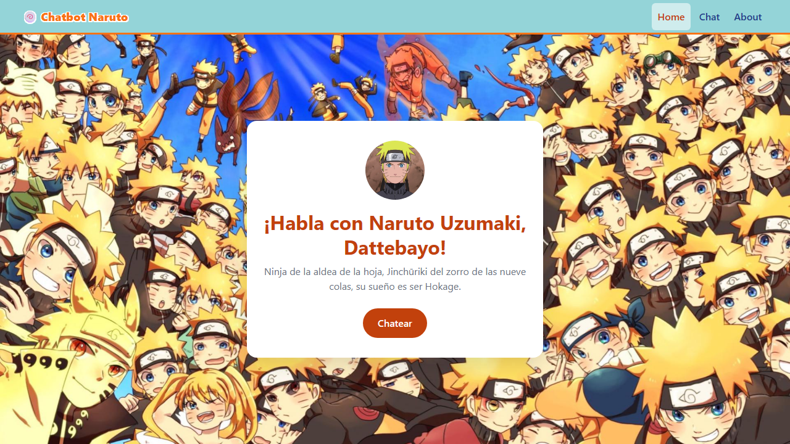
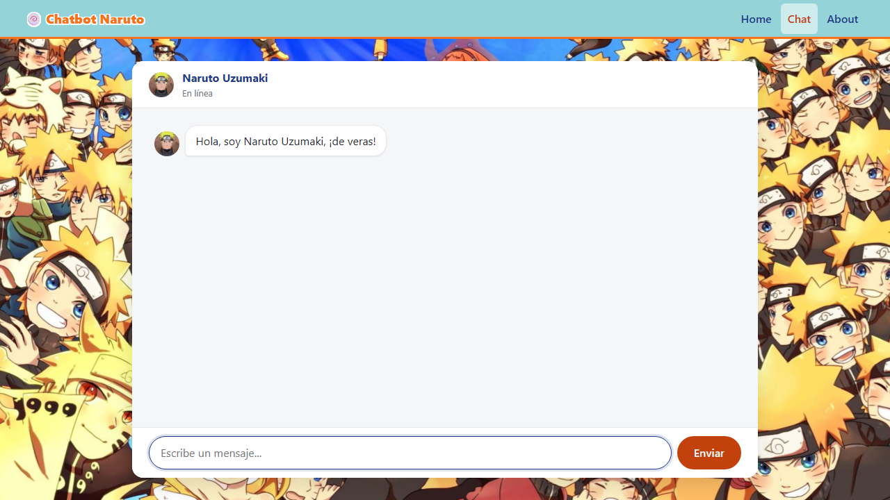
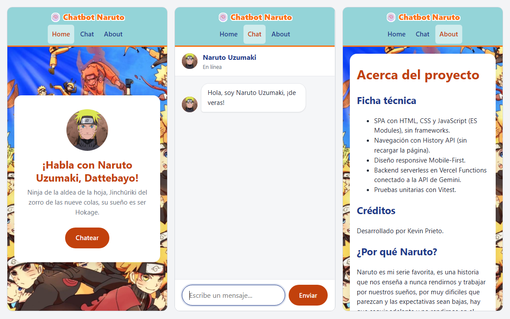

# 🍥 Chatbot Naruto

Aplicación web (SPA) para conversar con **Naruto Uzumaki** usando la API de **Google Gemini**. Proyecto académico del Módulo 3, desarrollado con HTML, CSS y JavaScript sin frameworks, con un backend serverless en Vercel.

**🔗 Demo en producción:** https://chatbot-naruto.vercel.app

---

## Capturas

**Escritorio: inicio**



**Escritorio: chat**



**Móvil: inicio, chat y about**



---

## Funcionalidades

- **Chat con personaje:** Naruto (época Shippuden) responde con su personalidad, sus muletillas ("¡de veras!", "¡dattebayo!") y respuestas breves.
- **Memoria de la conversación:** se envía el historial completo en cada petición, así el personaje recuerda lo que se habló durante la sesión.
- **Navegación SPA:** rutas `/home`, `/chat` y `/about` sin recargar la página, con soporte para los botones atrás/adelante del navegador.
- **Diseño mobile-first:** 3 breakpoints (móvil, tablet y escritorio), unidades relativas y Flexbox.
- **Estados de la interfaz:** indicador de "escribiendo…", scroll automático, bloqueo del input mientras responde y mensajes de error visibles.
- **API key protegida:** la clave de Gemini solo existe en el servidor; el navegador nunca la ve.
- **Modelos de respaldo:** si un modelo de Gemini está saturado, el backend prueba automáticamente con el siguiente.

---

## Tecnologías

| Área | Tecnología |
|---|---|
| Frontend | HTML5, CSS3, JavaScript (ES Modules) |
| Navegación | History API (`pushState` / `popstate`) |
| Backend | Vercel Functions (Node.js) |
| IA | Google Gemini API (REST) |
| Tests | Vitest |
| Despliegue | Vercel + GitHub |

---

## Estructura del proyecto

```
├── api/
│   └── functions.js        # Backend: proxy seguro hacia Gemini (system prompt, validación, fallback)
├── src/
│   ├── assets/             # Imágenes (avatar y fondo)
│   ├── views/
│   │   ├── homeView.js     # Vista /home
│   │   ├── chatView.js     # Vista /chat
│   │   └── aboutView.js    # Vista /about
│   ├── index.html          # Única página de la SPA
│   ├── styles.css          # Estilos mobile-first
│   ├── app.js              # Router (pushState / popstate)
│   ├── chat.js             # Lógica del chat (historial, render, fetch, estados)
│   └── utils.js            # Funciones puras (formato, validación, parseo, payload)
├── tests/
│   ├── utils.test.js       # validateInput, formatMessage, parseGeminiResponse
│   ├── app.test.js         # buildPromptPayload
│   └── functions.test.js   # Backend con fetch simulado (mocking)
├── .env.example            # Plantilla de variables de entorno
├── vercel.json             # Reescrituras para la SPA
└── package.json
```

---

## Instalación y ejecución local

### Requisitos

- [Node.js](https://nodejs.org) 18 o superior
- [Vercel CLI](https://vercel.com/docs/cli): `npm install -g vercel`
- Una API key de Gemini (gratis en [Google AI Studio](https://aistudio.google.com/apikey))

### Pasos

1. **Clonar el repositorio e instalar dependencias:**

   ```bash
   git clone https://github.com/Kevinprieto07/ProyectoM3_KevinPrieto.git
   cd ProyectoM3_KevinPrieto
   npm install
   ```

2. **Configurar las variables de entorno.** Copia la plantilla y escribe tu clave real:

   ```bash
   cp .env.example .env
   ```

   ```env
   GEMINI_API_KEY=tu_api_key_aqui
   ```

   > El archivo `.env` está en `.gitignore` y nunca se sube al repositorio.

3. **Levantar el servidor local:**

   ```bash
   vercel dev
   ```

   La primera vez pedirá iniciar sesión y enlazar el proyecto. Luego abre **http://localhost:3000**.

   > Usa `vercel dev` y no abras `index.html` directamente: hace falta para que funcionen el backend (`/api/functions`) y las reescrituras de rutas de la SPA.

---

## Tests

```bash
npm test             # ejecuta todos los tests una vez
npm run test:watch   # modo observador mientras se desarrolla
```

La suite tiene **12 tests**, repartidos en 3 archivos:

| Archivo | Qué prueba |
|---|---|
| `utils.test.js` | `validateInput` rechaza textos vacíos; `formatMessage` devuelve `{ role, text, timestamp }` (con `Date.now` simulado); `parseGeminiResponse` extrae el texto y lanza un error controlado ante respuestas anómalas |
| `app.test.js` | `buildPromptPayload` convierte los roles `user` / `character` al formato de Gemini (`user` / `model`) |
| `functions.test.js` | El backend con **`fetch` simulado**: respuesta correcta, fallback de modelo, todos los modelos saturados (503), método no permitido (405) y datos inválidos (400) |

Los tests del backend usan **mocking** (`vi.fn`, `vi.spyOn`, `vi.stubGlobal`, `vi.stubEnv`), así que no llaman a Gemini ni necesitan una API key real.

---

## Despliegue en Vercel

1. Subir el repositorio a GitHub (verificando que `.env` **no** esté incluido).
2. En [Vercel](https://vercel.com), importar o conectar el repositorio en **Settings → Git**.
3. En **Settings → Environment Variables**, añadir `GEMINI_API_KEY` con su valor para *Production* y *Preview*.
4. Configuración de build: Framework Preset **Other**, sin *Build Command* ni *Output Directory*.
5. Desplegar. Después, cada `git push` a `main` publica una nueva versión automáticamente.

El archivo `vercel.json` redirige todas las rutas a `src/index.html`, para que recargar en `/chat` o `/about` no devuelva un error 404:

```json
{
  "rewrites": [{ "source": "/(.*)", "destination": "/src/index.html" }]
}
```

---

## Arquitectura y seguridad

```
Navegador (chat.js)  ──POST { messages }──►  /api/functions  ──►  Gemini API
                     ◄──── { reply } ──────   (usa GEMINI_API_KEY)
```

- El frontend **nunca** contacta a Gemini directamente; siempre pasa por el backend.
- La API key se lee con `process.env.GEMINI_API_KEY`: desde `.env` en local y desde las variables de entorno de Vercel en producción.
- El **system prompt** vive en el servidor, así que no se puede modificar desde el navegador.
- El backend valida los datos recibidos y limita cada mensaje a 1000 caracteres.
- Los mensajes se insertan en la página con `textContent`, para evitar la inyección de HTML.

---

## Autor

**Kevin Prieto**: proyecto académico, Módulo 3.

Naruto es un personaje creado por Masashi Kishimoto. Este proyecto tiene fines exclusivamente educativos y no tiene relación con los titulares de los derechos.

---

## Uso de IA:

- Se utilizo Claude y Claude code como apoyo para la elaboración de este proyecto
- El archivo principal del chat de claude se encuentra en la carpeta Documentación IA de este repositorio
- Claude code intervino directamente en el código para la elaboración de tests, mejoras y arreglos
del diseño de la página (A petición del autor) y organización del Readme.md 

Todas las modificaciónes de IA fueron revisadas y validadas por (Kevin Prieto), autor del proyecto